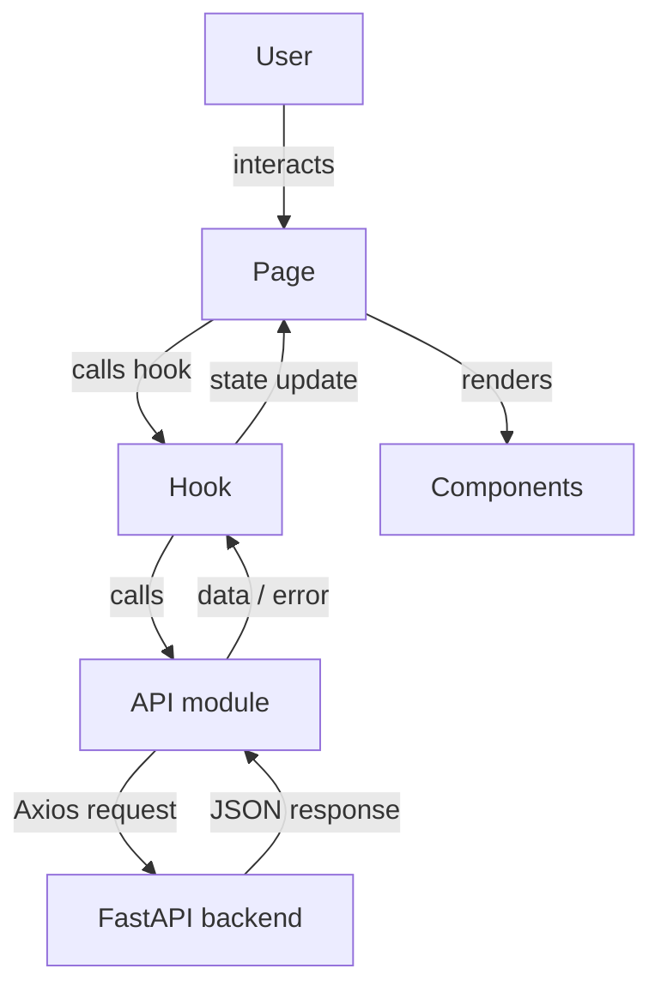

# Design Document — Smart Expense Tracker Frontend

## Overview

The Smart Expense Tracker Frontend is a React 18 + TypeScript single-page application (SPA) built with Vite. It communicates with a FastAPI backend via a versioned REST API and provides JWT-authenticated access to personal finance management features: transaction CRUD, category CRUD, a monthly dashboard with charts, and a responsive dark/light-mode UI.

Key design goals:
- **Thin client, thick API** — all business logic (validation rules, summaries, sorting) lives in the backend; the frontend focuses on UX.
- **Stateless auth** — JWT stored in `localStorage`; every request is independently authenticated.
- **Component locality** — data-fetching state lives in the component that renders it, keeping the state tree shallow and predictable.
- **Progressive enhancement** — every data section has distinct loading, error, and empty states so the user always knows the app's status.

---

## Architecture

### High-Level Structure

```
frontend/
├── public/
├── src/
│   ├── api/
│   │   ├── client.ts          # Axios instance with interceptors
│   │   ├── auth.ts            # Auth API calls
│   │   ├── transactions.ts    # Transaction API calls
│   │   └── categories.ts      # Category API calls
│   ├── components/
│   │   ├── layout/
│   │   │   ├── Navbar.tsx
│   │   │   └── ProtectedRoute.tsx
│   │   ├── ui/
│   │   │   ├── LoadingSpinner.tsx
│   │   │   ├── EmptyState.tsx
│   │   │   └── ConfirmModal.tsx
│   │   ├── dashboard/
│   │   │   ├── SummaryCards.tsx
│   │   │   ├── MonthPicker.tsx
│   │   │   ├── BarChartWidget.tsx
│   │   │   ├── DonutChartWidget.tsx
│   │   │   └── TransactionList.tsx
│   │   └── transactions/
│   │       └── TransactionForm.tsx
│   ├── pages/
│   │   ├── AuthPage.tsx
│   │   ├── DashboardPage.tsx
│   │   └── CategoriesPage.tsx
│   ├── hooks/
│   │   ├── useAuth.ts
│   │   ├── useTransactions.ts
│   │   ├── useCategories.ts
│   │   └── useDashboardSummary.ts
│   ├── types/
│   │   └── index.ts           # Shared TypeScript interfaces
│   ├── utils/
│   │   ├── formatters.ts      # Currency & date formatting helpers
│   │   └── theme.ts           # Dark-mode helpers
│   ├── App.tsx                # Router setup
│   └── main.tsx               # Vite entry; theme bootstrap
├── index.html
├── vite.config.ts
├── tailwind.config.ts
└── package.json
```

### Routing

| Path | Component | Guard |
|---|---|---|
| `/login` | `AuthPage` | Redirect to `/dashboard` if already authenticated |
| `/dashboard` | `DashboardPage` | `ProtectedRoute` |
| `/categories` | `CategoriesPage` | `ProtectedRoute` |
| `*` | Redirect to `/dashboard` | — |

`ProtectedRoute` checks `localStorage.getItem("access_token")`. If absent, it renders `<Navigate to="/login" replace />`.

### Data Flow



Each page owns its top-level state (loading flags, error messages, data arrays). Hooks encapsulate the fetch/mutate logic and return `{ data, loading, error, refetch }` tuples.

---

## Components and Interfaces

### `src/api/client.ts` — Axios Instance

```typescript
// Single shared Axios instance
const apiClient = axios.create({ baseURL: "http://localhost:3000/api/v1" });

// Request interceptor: attach JWT if present
apiClient.interceptors.request.use(config => {
  const token = localStorage.getItem("access_token");
  if (token) config.headers["Authorization"] = `Bearer ${token}`;
  return config;
});

// Response interceptor: handle 401 globally
apiClient.interceptors.response.use(
  res => res,
  err => {
    if (err.response?.status === 401) {
      localStorage.removeItem("access_token");
      window.location.href = "/login";
    }
    return Promise.reject(err);
  }
);
```

### `src/pages/AuthPage.tsx`

- Single route `/login`.
- Internal state: `mode: "login" | "register"`.
- On successful login: stores token → navigates to `/dashboard`.
- On successful register: automatically calls login with same credentials, then navigates to `/dashboard`.
- Displays inline field-level validation errors (empty fields) before touching the API.
- Displays API `detail` errors below the submit button.

### `src/components/layout/Navbar.tsx`

Props: none (reads `localStorage` directly for user display name — stored on login).

State: `menuOpen: boolean` for mobile hamburger.

Responsibilities:
- Links to `/dashboard` and `/categories`.
- Logout button (clears token, navigates).
- Dark/light mode toggle — toggles `dark` class on `<html>`, persists `theme` key in `localStorage`.
- Responsive: below 768 px, links and toggle collapse behind a hamburger button.

> **Design decision**: User `first_name`/`last_name` is stored in `localStorage` alongside the token at login time (using the `POST /auth/register` 201 response or a lightweight user-profile call). This avoids a dedicated `/users/me` endpoint call on every page load. If no profile info is cached, the Navbar falls back to the token's email claim or an empty string.

### `src/pages/DashboardPage.tsx`

Top-level state:
```typescript
selectedYear: number       // current calendar year on load
selectedMonth: number      // 1–12, current calendar month on load
isAllTime: boolean         // "All Time" toggle
```

On mount and on `selectedMonth`/`selectedYear`/`isAllTime` changes: fetches summary, transactions (with appropriate date parameters).

Child components: `MonthPicker`, `SummaryCards`, `BarChartWidget`, `DonutChartWidget`, `TransactionList`, `TransactionForm` (modal), `ConfirmModal`.

### `src/components/dashboard/MonthPicker.tsx`

```typescript
interface MonthPickerProps {
  year: number;
  month: number;           // 1–12
  isAllTime: boolean;
  onPrev: () => void;
  onNext: () => void;
  onToggleAllTime: () => void;
}
```

- Formats month/year as "MMMM YYYY" using `Intl.DateTimeFormat`.
- Disables "next" when `year === currentYear && month === currentMonth`.
- Disables prev/next when `isAllTime` is true.

### `src/components/dashboard/SummaryCards.tsx`

```typescript
interface SummaryCardsProps {
  summary: MonthlySummary | null;
  loading: boolean;
  error: string | null;
}
```

Three cards: Total Income (green), Total Expenses (red), Net Balance (blue, or red if net < 0). While loading, each card body shows a `LoadingSpinner`. On error, a single error banner spans all three.

### `src/components/dashboard/BarChartWidget.tsx`

Uses Recharts `BarChart`. Receives `{ totalIncome, totalExpense }` numbers. Renders two bars (green income, red expense) with labelled X/Y axes. On zero transactions → `EmptyState`.

### `src/components/dashboard/DonutChartWidget.tsx`

Uses Recharts `PieChart` with `innerRadius`. Receives `transactions: Transaction[]` filtered to `type === "expense"`. Groups by `category_id`, sums amounts per category, maps to `[{ name, value, fill }]`. Renders legend with category names. On zero expense transactions → `EmptyState`.

### `src/components/dashboard/TransactionList.tsx`

```typescript
interface TransactionListProps {
  transactions: Transaction[];
  categories: Category[];
  loading: boolean;
  error: string | null;
  onEdit: (tx: Transaction) => void;
  onDelete: (tx: Transaction) => void;
}
```

Each row: date ("MMM D, YYYY"), description or "—", category name (resolved from `categories`), amount (green/red). Skeleton rows while loading. `EmptyState` when empty.

### `src/components/transactions/TransactionForm.tsx`

```typescript
interface TransactionFormProps {
  open: boolean;
  transaction: Transaction | null; // null = create mode
  categories: Category[];
  onSuccess: () => void;
  onClose: () => void;
}
```

Fields: amount, date (max = today), type dropdown, category dropdown (filtered by type), description (optional, max 255).

- In edit mode, pre-populates all fields and shows a Delete button.
- On type change, filters categories and clears selected category.
- Sends `POST /transactions` (create) or `PUT /transactions/{id}` (edit).
- Handles 422 field-level errors and generic errors separately.

### `src/pages/CategoriesPage.tsx`

State: `categories: Category[]`, `loading`, `error`, `editTarget: Category | null`, `deleteTarget: Category | null`.

- Inline create form always visible at top.
- Each category row: name, type badge (green "income" / red "expense"), Edit button, Delete button.
- Edit opens an inline edit form or simple modal pre-populated with current values.
- Delete triggers `ConfirmModal` with the cascade-warning message.
- 409 error → show "A category with this name already exists." next to name field.

### `src/components/ui/ConfirmModal.tsx`

```typescript
interface ConfirmModalProps {
  open: boolean;
  message: string;
  loading: boolean;
  error: string | null;
  onConfirm: () => void;
  onCancel: () => void;
}
```

Generic reusable confirmation dialog. Disables Confirm while loading.

---

## Data Models

### TypeScript Interfaces (`src/types/index.ts`)

```typescript
export type TransactionType = "income" | "expense";
export type CategoryType   = "income" | "expense";

export interface User {
  id: number;
  email: string;
  first_name: string;
  last_name: string;
  created_at: string; // ISO 8601
}

export interface Category {
  id: number;
  name: string;
  category_type: CategoryType;
  user_id: number;
}

export interface Transaction {
  id: number;
  amount: number;          // Decimal serialised as number by FastAPI
  date: string;            // "YYYY-MM-DD"
  type: TransactionType;   // aliased from "transaction_type" by backend
  category_id: number;
  description: string | null;
  created_at: string;
  updated_at: string | null;
}

export interface MonthlySummary {
  total_income: number;
  total_expense: number;
  net: number;
}

export interface AuthTokenResponse {
  access_token: string;
}

// --- Request payloads ---

export interface TransactionCreatePayload {
  amount: number;
  date: string;            // "YYYY-MM-DD"
  type: TransactionType;
  category_id: number;
  description?: string | null;
}

export interface TransactionUpdatePayload extends Partial<TransactionCreatePayload> {}

export interface CategoryCreatePayload {
  name: string;
  category_type: CategoryType;
}

export interface CategoryUpdatePayload extends Partial<CategoryCreatePayload> {}
```

> **Note on `type` alias**: The backend schema uses `Field(alias='type')` on `transaction_type`. FastAPI serialises responses using the alias key `"type"`, so the frontend receives `transaction.type` directly. Requests should also send `"type"` (not `"transaction_type"`).

### Local Storage Keys

| Key | Value | Set by |
|---|---|---|
| `access_token` | JWT string | Login success |
| `user_profile` | JSON-serialised `User` | Login/register success |
| `theme` | `"dark"` \| `"light"` | Dark mode toggle |

---

## Correctness Properties

*A property is a characteristic or behavior that should hold true across all valid executions of a system — essentially, a formal statement about what the system should do. Properties serve as the bridge between human-readable specifications and machine-verifiable correctness guarantees.*

### Property 1: JWT Attachment Invariant

*For any* outgoing Axios request made while `localStorage` contains a non-empty `access_token`, the request's `Authorization` header SHALL equal `"Bearer " + access_token`. Conversely, for any request made when `access_token` is absent from `localStorage`, no `Authorization` header SHALL be present.

**Validates: Requirements 1.6, 1.7**

---

### Property 2: Auth Form Submission Gate

*For any* Login or Sign-Up form submission attempt where at least one required field is empty (empty string or whitespace-only), the system SHALL not dispatch any API call, and the form's error state SHALL be non-empty.

**Validates: Requirements 2.9**

---

### Property 3: ProtectedRoute Redirection Invariant

*For any* navigation event to a protected route, if `localStorage` does not contain a non-empty `access_token`, the resulting rendered route SHALL be `/login`. Conversely, if `access_token` is present and the user navigates to `/login`, the resulting rendered route SHALL be `/dashboard`.

**Validates: Requirements 3.1, 3.2, 3.3**

---

### Property 4: 401 Global Logout Invariant

*For any* API response with HTTP status 401, after the response interceptor runs: (a) `localStorage` SHALL NOT contain the key `access_token`, and (b) the browser location SHALL be `/login`.

**Validates: Requirements 3.5**

---

### Property 5: Transaction Amount Display Invariant

*For any* transaction in the rendered transaction list, if `transaction.type === "income"` then the amount SHALL be rendered with green text classes; if `transaction.type === "expense"` then the amount SHALL be rendered with red text classes.

**Validates: Requirements 8.3, 13.5**

---

### Property 6: Category Dropdown Filter Invariant

*For any* selected `type` value in the TransactionForm, all options rendered in the category dropdown SHALL have `category_type === type`. No option with a mismatched `category_type` SHALL appear in the dropdown.

**Validates: Requirements 9.11**

---

### Property 7: Monetary Formatting Invariant

*For any* monetary amount value displayed in the SummaryCards or transaction list, the rendered string SHALL contain exactly one decimal point followed by exactly two digits (i.e. matches the pattern `/\.\d{2}$/`).

**Validates: Requirements 5.7**

---

### Property 8: Dark Mode Theme Persistence Round-Trip

*For any* toggling of the dark mode switch, the resulting state of the `dark` class on `<html>` and the value in `localStorage["theme"]` SHALL be consistent: `dark` class present ↔ `localStorage["theme"] === "dark"`, and `dark` class absent ↔ `localStorage["theme"] === "light"`.

**Validates: Requirements 4.7, 4.8, 13.3, 13.4**

---

### Property 9: Month Navigation Boundary Invariant

*For any* MonthPicker state where the selected month equals the current calendar month and year, the "next month" button SHALL be in a disabled state. For any other month, the "next month" button SHALL be enabled.

**Validates: Requirements 6.6**

---

### Property 10: Summary Card Net Balance Colour Invariant

*For any* `MonthlySummary` response where `net < 0`, the Net Balance card SHALL render the amount with red text. For any response where `net >= 0`, the Net Balance card SHALL render the amount with blue text.

**Validates: Requirements 5.4**

---

## Error Handling

### Error Classification

| Source | HTTP Status | Frontend Behaviour |
|---|---|---|
| Network failure | — (no response) | Show "Unable to reach server. Please check your connection." |
| Auth failure | 401 | Interceptor: clear token, redirect `/login` |
| Validation error | 422 | Field-level messages below affected inputs (TransactionForm, CategoryForm) |
| Conflict | 409 | "A category with this name already exists." next to name field |
| Server error | 500 | Generic inline error message in the requesting section |
| Any other 4xx | 4xx | Display `error.response.data.detail` if present, else generic message |

### Error Message Strategy

- Errors are **scoped to the UI section that triggered them** — a failed transaction fetch does not affect the summary cards section.
- Raw status codes and stack traces are never shown to the user.
- Error messages are dismissed/replaced when a subsequent successful request for the same data completes.
- Form errors (field-level) are cleared when the user modifies the affected field.

### `extractErrorMessage` Utility

```typescript
// src/utils/errorHandling.ts
export function extractErrorMessage(err: unknown, fallback = "Something went wrong."): string {
  if (axios.isAxiosError(err)) {
    const detail = err.response?.data?.detail;
    if (typeof detail === "string") return detail;
    if (Array.isArray(detail)) return detail.map(d => d.msg).join(", ");
  }
  return fallback;
}
```

This normalises FastAPI's validation error format (`detail` as string or array of `{loc, msg, type}` objects) into a single displayable string.

---

## Testing Strategy

### Dual Testing Approach

The testing strategy combines example-based unit/integration tests with property-based tests. Unit tests cover specific scenarios and edge cases; property tests validate universal invariants across randomised inputs.

### Unit / Integration Tests (Vitest + React Testing Library)

**Auth**
- Login form submits correct payload to `POST /auth/login`.
- Register form auto-logs in after 201 response.
- Empty field submission shows validation errors without API call.
- API `detail` error renders below the submit button.

**Routing**
- Unauthenticated user navigating to `/dashboard` ends up at `/login`.
- Authenticated user navigating to `/login` ends up at `/dashboard`.
- Logout clears `localStorage` and redirects.

**Dashboard**
- Month navigation increments/decrements month correctly across year boundaries.
- "All Time" toggle hides summary cards and passes correct params to API.
- Summary cards show loading skeletons while fetching.
- Empty transaction list renders `EmptyState` with correct message.

**TransactionForm**
- Type dropdown change filters categories and clears selection.
- Date field capped at today's date.
- 422 response surfaces field-level errors.

**CategoriesPage**
- 409 error displays "A category with this name already exists." message.
- Empty category list shows the correct `EmptyState` message.

### Property-Based Tests (fast-check)

Each property-based test runs a minimum of **100 iterations**. Tests reference the design property they validate using a comment tag in the format:
`// Feature: smart-expense-tracker-frontend, Property N: <property_text>`

**Property 1 — JWT Attachment Invariant**
- Generate arbitrary request configs with `localStorage` in two states (token present / absent).
- Assert header presence/absence matches expectation.

**Property 2 — Auth Form Submission Gate**
- Generate arbitrary form states where at least one required field is empty or whitespace-only.
- Assert the submit handler never calls the API client.

**Property 3 — ProtectedRoute Redirection Invariant**
- Generate arbitrary route paths (protected and `/login`).
- Assert rendered route matches expected redirect based on auth state.

**Property 5 — Transaction Amount Display Invariant**
- Generate arbitrary `Transaction` objects with random `type` values.
- Render `TransactionList` and assert colour classes match type.

**Property 6 — Category Dropdown Filter Invariant**
- Generate arbitrary lists of `Category` objects and random `type` selections.
- Assert rendered category options' `category_type` all equal the selected type.

**Property 7 — Monetary Formatting Invariant**
- Generate arbitrary positive numbers (including edge cases like 0.1, 1000000, 0.999).
- Assert `formatCurrency(n)` output matches `/\.\d{2}$/`.

**Property 8 — Dark Mode Theme Persistence Round-Trip**
- Generate arbitrary sequences of toggle actions.
- Assert `<html>` class and `localStorage["theme"]` remain consistent after each toggle.

**Property 9 — Month Navigation Boundary Invariant**
- Generate arbitrary `(year, month)` pairs relative to the current date.
- Assert "next" button disabled state matches whether the pair equals the current month.

**Property 10 — Summary Card Net Balance Colour Invariant**
- Generate arbitrary `MonthlySummary` objects with positive, negative, and zero `net` values.
- Assert rendered Net Balance card uses red for negative, blue for non-negative.

### Test Configuration

```typescript
// vitest.config.ts
export default {
  test: {
    environment: "jsdom",
    setupFiles: ["./src/test/setup.ts"],
    globals: true,
  }
}
```

Property tests use `fast-check` (`fc.assert(fc.property(...))` with `{ numRuns: 100 }`). Mock Axios using `vitest`'s `vi.mock` or `msw` for handler-level mocking.
